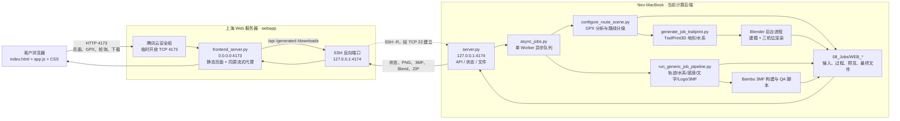
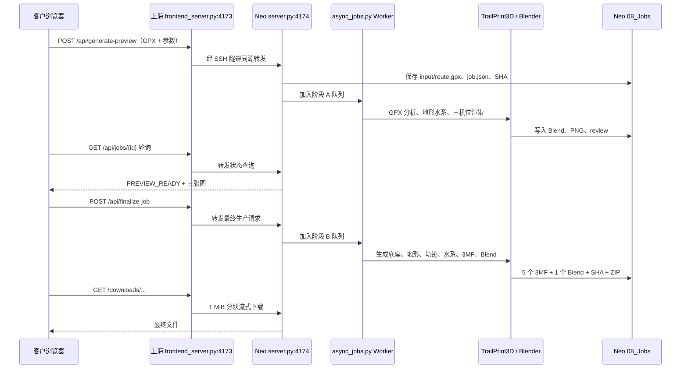

# WEB09｜前后端脚本与端口架构

更新日期：2026-08-21
范围：上海 Web + Neo 计算后端的当前已联调版本

## 1. 当前部署架构



## 2. 前端执行的内容

### 客户浏览器

| 文件 | 职责 | 是否建模 |
|---|---|---|
| `09_WebApp/local/index.html` | 单页结构、上传区、参数区、两阶段图墙、队列和下载区 | 否 |
| `09_WebApp/local/app.js` | 读取 GPX、计算浏览器概览、收集参数、匿名客户 ID、提交任务、轮询、展示图片和下载入口 | 否 |
| `09_WebApp/local/config.js` | API 根地址；上海部署使用空字符串，表示同源请求 | 否 |
| `dashboard.css`、`single-page.css`、`flow.css` 等 | 页面布局与视觉样式 | 否 |

浏览器中的 GPX 点数、距离和路线示意只用于即时交互。最终地形、轨迹、水系和打印文件不由浏览器生成。

### 上海服务器

| 文件 | 职责 |
|---|---|
| `09_WebApp/local/frontend_server.py` | 提供静态页面；把 `/api/`、`/generated/`、`/downloads/` 流式转发到 `127.0.0.1:4174` |
| `09_WebApp/deploy/gpx-web.service.example` | 上海 Web systemd user service 模板，尚未正式启用 |

上海服务器当前不执行 `server.py`、`async_jobs.py`、Blender 或任何 3MF 构建脚本，也不持久化任务成果。

## 3. 后端执行的关键脚本

### API 与异步队列

| 文件 | 职责 |
|---|---|
| `09_WebApp/local/server.py` | 接收 GPX 与参数、匿名任务隔离、任务状态、队列统计、预览与文件下载 API |
| `09_WebApp/local/async_jobs.py` | 单 Worker 队列；建立任务目录；调用预览/最终流水线；生成清单、SHA 和 ZIP |
| `09_WebApp/manage_split.py` | Neo 本地启动、停止和检查前后端进程；不是请求处理脚本 |

### 阶段 A：工程仿真

| 顺序 | 脚本 | 作用 |
|---|---|---|
| A1 | `configure_route_scene.py` | 解析 GPX 事实，选择 LOCAL_HIKE / LONG_HIKE / REGIONAL_OVERVIEW 等路线策略 |
| A2 | `generate_job_trailprint.py` | 在 Blender 内调用 TrailPrint3D，生成真实地形、水系和轨迹源场景 |
| A3 | `render_web_trailprint_preview.py` | Blender 后台渲染装配、顶视、侧视三机位 PNG |

### 阶段 B：最终 5+1

总编排脚本：`07_Knowledge/tools/run_generic_job_pipeline.py`

主要子脚本按顺序执行：

1. `generate_job_trailprint.py`：生成 TrailPrint3D 源场景；
2. `build_trail_insert_and_groove.py`：轨迹安装件和槽；
3. `add_trail_endpoint_relief.py`：起点、终点符号；
4. `unify_trail_hidden_bridges.py`：轨迹隐藏桥和一体化；
5. 区域路线可选 `probe_regional_route_water.py`、`build_blender_water_geometry.py`；
6. `build_three_band_print_model.py`：绿、棕、灰三段地形；
7. `build_water_inserts_and_grooves.py`：蓝色水系和安装槽；
8. `rebuild_base_for_frame_glue_fit.py`：奖牌框适配底座；
9. `update_three_edge_labels.py`：标题、日期、里程；
10. `build_route_logo_svg.py`、`add_base_bottom_logo_inlay.py`：Logo SVG 和底面嵌件；
11. `finalize_job_scene_and_parts.py`：最终场景与打印部件；
12. `repair_job_parts.py`、`layout_job_print_parts.py`：修复、规范方向和同盘排布；
13. `build_bambu_job_3mf.py`：生成 01–04 四类 3MF；
14. `build_bambu_one_plate_3mf.py`：生成 05 四件同盘；
15. `validate_bambu_four_object_plate.py`：检查四对象层级；
16. `prepare_blender_delivery.py`：生成 06 Blender 设计项目及最终三机位；
17. `validate_generic_release.py`：最终 5+1 发布 QA。

## 4. 端口表

| 位置 | 地址/端口 | 用途 | 公网暴露 |
|---|---|---|---|
| 上海 | `0.0.0.0:4173` | 当前临时 Web 页面与同源网关 | 是，临时 |
| 上海 | `127.0.0.1:4174` | SSH 反向隧道落点 | 否 |
| Neo | `127.0.0.1:4174` | Python API + Worker 后端 | 否 |
| 上海 | TCP `22` | Neo 主动连接上海并建立 `ssh -R` | SSH 公网入口 |
| 上海 | TCP `80/443` | 未来 Nginx HTTP/HTTPS 正式入口 | 80 已有；443 待配置 |
| Blender | 无监听端口 | 由后端用命令行子进程调用 | 否 |

当前隧道命令：

```bash
ssh -NT \
  -o ExitOnForwardFailure=yes \
  -o ServerAliveInterval=30 \
  -o ServerAliveCountMax=3 \
  -R 127.0.0.1:4174:127.0.0.1:4174 \
  gpx-shanghai-web
```

含义：上海只监听本机 `4174`；任何到这个端口的请求经 SSH 返回 Neo 的 `4174`，Neo 家庭网络无需开放入站端口。

## 5. 一次任务的数据流



## 6. Mac mini 迁移时的边界

迁移后，上海端和浏览器端不变。只把以下内容从 Neo 搬到 Mac mini：

- `server.py`、`async_jobs.py`；
- `07_Knowledge/tools/` 全套生产脚本；
- Blender、TrailPrint3D、字体与 3MF 基线模板；
- `08_Jobs/` 任务工作区；
- 反向 SSH 隧道的发起端。

隧道仍映射上海 `127.0.0.1:4174`，因此上海前端配置和客户 URL 无需变化。

## 7. 当前生产化缺口

- 临时公网 `4173` 应切换为 Nginx HTTPS `443`；
- 上海 Web 和反向隧道需要 systemd/launchd 自动恢复；
- 任务数据库目前是 `08_Jobs` 文件状态，不是独立数据库；
- 交付文件目前保存在计算节点，后续应推送对象存储并支持断点续传；
- Mac mini 迁移前必须用同一真实 GPX 重跑阶段 A、阶段 B、SHA 和公网下载回归。
