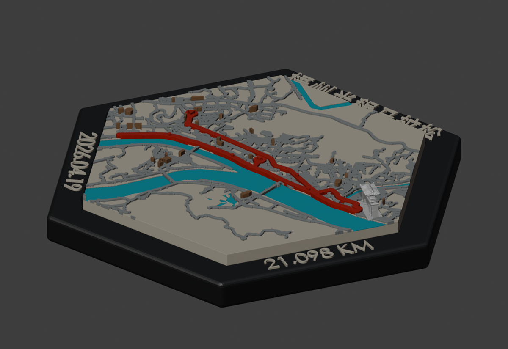
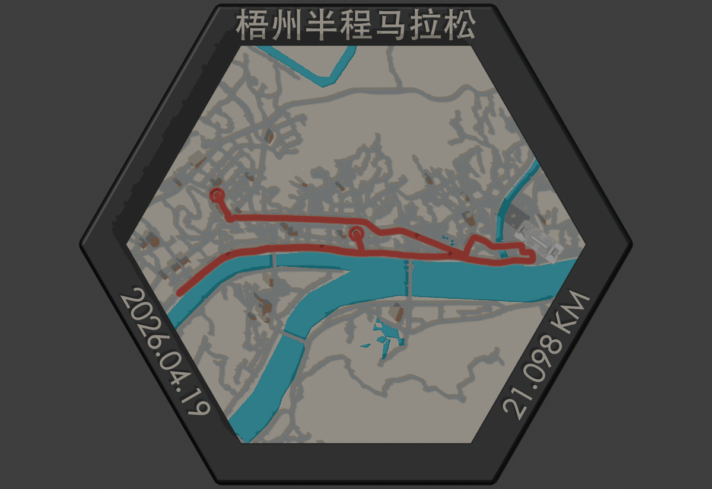
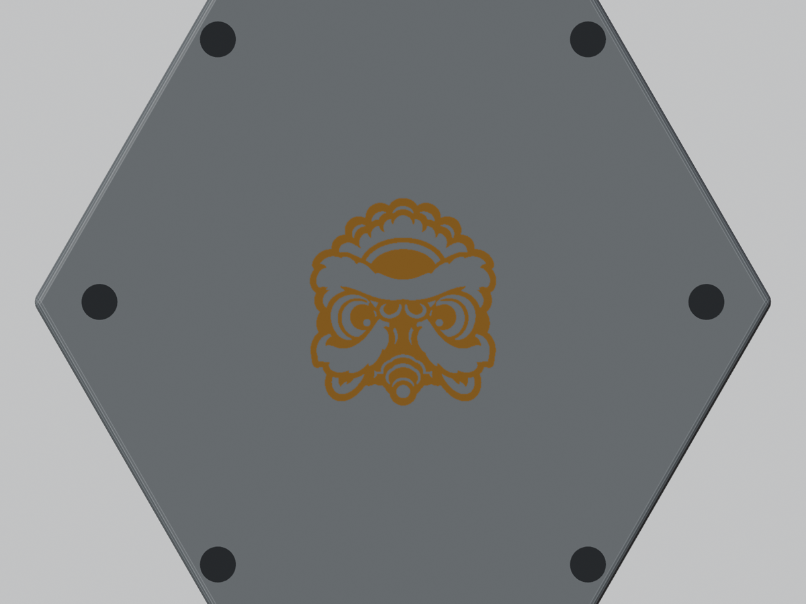
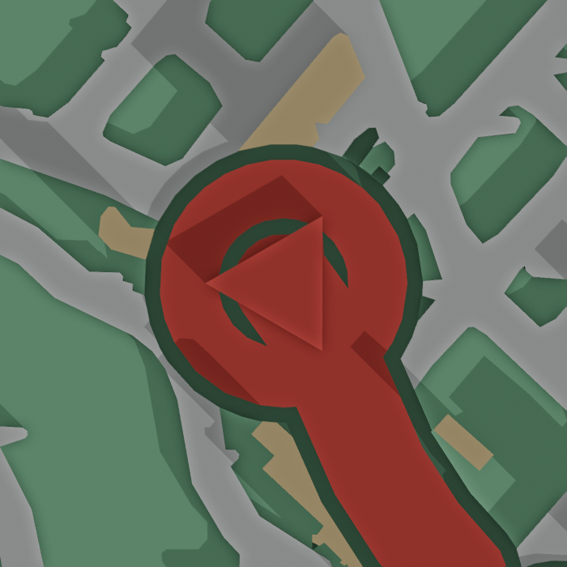
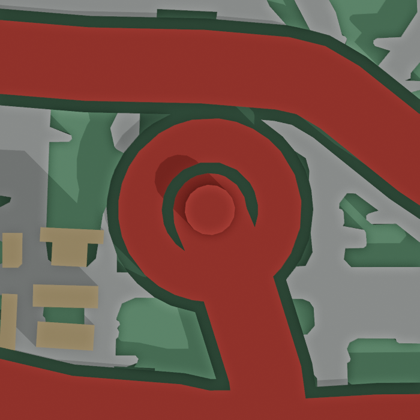

# 城市马拉松 GPX｜标准生产与输出契约

状态：V7.1，吸收柏林 V7R1–V7R6 的文字、实体承托、地标支撑及 GUI 回归经验；既有真机验收状态分别保留
生效日期：2026-09-07

## 1. 目标

用户提供一份马拉松 GPX 后，系统以 TrailPrint3D 为城市空间事实入口，输出可查看、可分色、可拆装、可切片、可追溯的固定尺寸纪念沙盘套装。

“自动输出”不等于跳过确认。与审美或赛事事实相关的内容必须经过一次创意确认；数字检查不能代替 Bambu GUI 和必要的真机抽样。

## 2. 输入合同

### 必需输入

- 一份有效 GPX，至少包含一条有序轨迹和经纬度点。

### 开工登记

- 创建 `process/成本账本.md`，写入 Job、版本、开始时间、统计边界和操作者。
- 记录可取得的 Codex/API Token 起始快照：模型、输入、缓存输入、输出、总量、数据来源和时间。
- 若运行环境不提供任务级 Token，立即登记 `MISSING` 及原因，并把“封板前补录平台明细”列为未决项；不能等到项目结束才首次发现无法统计。
- 外部生成工具在调用前记录余额或积分，在调用后记录变化、成功/失败次数与采用的产出物。

### 自动派生

- GPX SHA-256、点数、记录里程、时间范围、路线包围盒和城市中心。
- TrailPrint3D 原生源 Blend、实际插件参数、道路、水体、建筑和路线中心线。

### 必须核实的赛事信息

- 正式赛事全称、年份、比赛日期和官方距离。
- 城市标志物选择及颜色。
- 奖牌图案来源；未提供官方图案时，只能使用明确标注为“纪念性”的标准化奖牌图案，不能伪称官方奖牌。

这些信息可由系统检索并提出候选，但必须记录来源或得到用户确认。GPX 自身不能保证包含官方赛事名称、官方日期和奖牌设计。

## 3. 固定产品结构

默认城市马拉松严格采用以下四个顶层物理件（顺序也是交付清单顺序）：

1. 底座：主体＋底部图案／侧边文字所需材料子体。
2. 红色连续轨迹：单件顶装，带起终点触觉符号；全马默认含 10K、半马、30K、40K 触点。
3. 标志性建筑：单件顶装，默认白色；颜色可按项目确认改变。
4. 城市沙盘地形：水系、地面、道路、建筑可以是多个材料子体，但必须归入同一个顶层对象并形成一个可整体拿取的物理件。

马拉松与徒步模型的关键差异：马拉松水系不是独立顶层打印件；它作为蓝色材料子体嵌入城市沙盘地形。不得因为需要分色，就把水系错误打包成第五个顶层对象。

底座与沙盘采用大夫山真机基线验证过的上方下沉安装逻辑：底座本体、侧边文字和底部装饰在同一打印任务中形成一个不可再拆的物理件；底座顶面保留与100毫米六边形沙盘同源的无倒扣浅承座。默认下沉深度 `0.80 mm`、法向单边间隙 `0.30 mm`，装配前先干配，可选极薄胶膜。边框宽度按项目审美调整，不机械复制大夫山的 `8.90 mm`。

城市垂直层次固定为：水面最低 → 地面 → 道路 → 建筑。小建筑不拆件，避免大量细小安装动作。

视觉主次：红色赛道是主体，水系与道路构成可辨认的城市背景，普通建筑仅作点缀。道路按城市尺度筛选疏密，建筑控制密度、高度和最薄特征，不能以密集楼群遮挡轨迹或淹没水系、道路。独立标志性建筑保留明确辨识度及与真实地点、赛道的空间关系。

### 3.1 统一 0.4 mm 与一体宽边框文字底座

- 四个物理件统一使用 0.4 mm 喷嘴，取消旧的 0.2 mm 文字盘及“4＋1”拆分方案。
- 底座主体、文字承载边框、文字及底部图案一体打印；多色材料子体不等于额外装配件。
- 底部创意必须先以 PNG 看图选定并锁稿。后续只允许从锁稿 PNG 自动提取轮廓、
  开槽和生成材料子体；禁止程序用基础几何重新绘制已确认图案。最终 3MF、底视图和
  首层刀路必须能追溯到同一 PNG 哈希。
- 参考大夫山画马成品，适当加宽边框，以实际汉字、字腔和边距所需空间确定宽度；不得为了保留窄框而压小汉字，也不得挤占已确认沙盘的安装开口。
- 国内赛事使用已确认的中文名称，例如“沈阳马拉松”；日期、里程分开排版，未经确认不改简称。
- 六边形边框的标题、日期、里程默认分布在三条互不相邻的交错边，形成“有字／留白”相间节奏；不得把三组文字集中在连续三边。确需改变时必须经过审美确认。
- 执行 `FDM中文小字可读性通用标准.md` 的 0.4 mm 几何与可读性门：优先真正粗黑字体，汉字建议字高至少 7 mm、笔画至少 0.80 mm、字内间隙至少 0.60 mm，并核对实际字形。不得以轮廓增肉量、实体体积或 manifold 通过代替可读性验收。
- 拉丁字母和数字建议实际字高至少 `5.0 mm`，最低 `4.0 mm` 只允许用于经确认的长标题；实体最窄笔画仍建议至少 `0.80 mm`，最低 `0.60 mm`。这里的字高、笔画和间隙均指字体转网格、缩放和重网格后的最终实体测量值，不是字体 `size` 参数。
- 文字建议凸起或嵌色有效高度 `0.60–0.80 mm`，与底座保持 `0.12–0.20 mm` 的实体搭接。只增加 Z 高度不能补救过小字形；“有四五层文字”也不能替代逐字辨识。
- 文字生成脚本必须在导出前断言实际字高、有效宽度、边缘余量、非流形边和正式字符串。标题放不下时，依次考虑真正的窄体粗黑字体、合理加宽边框或经用户确认的简称；禁止无提示压缩到门槛以下，也禁止漏掉冠名、连字符、年份等正式名称组成部分。
- 沈阳 V1s 仍是待真机验收候选，不能据此宣称小尺寸增粗汉字已验证成功。

旧双喷嘴文字框参数仅保留在历史项目记录，不再用于新马拉松交付。

## 4. TrailPrint3D 与制造层分工

- TrailPrint3D 是 GPX、地图范围、道路、水体、建筑和空间关系的首要事实来源，必须保留原生输出和参数证据。
- GIS/OSM 只用于补充、审计和筛选，不得无记录地取代 TrailPrint3D 坐标关系。
- Blender/Manifold3D/Shapely 负责尺寸、公差、简化、加固、层次、槽体、闭合实体和装配论证。
- Bambu Studio 负责真实打印机、喷嘴、耗材、料塔、逐件摆盘、切片和 G-code 语义。

## 5. 标准输出物

每个版本必须统一版本号，并至少包含：

- `00_...完整装配参考_标准3MF.3mf`
- `01_...双色底座.3mf`
- `02_...四色城市沙盘.3mf`
- `03_...红色连续轨迹.3mf`
- `04_...标志性建筑.3mf`
- `05_...四件同盘_标准3MF.3mf`
- `05_...四件同盘_Bambu原生工程.3mf`
- `06_装配论证/`：打开即见 Blend、组装图、拆件图、顶视图和几何报告
- `06_装配论证/` 还必须包含底部正视核验图和首层切片图；有磁孔或嵌色底纹时，两项不得省略。
- `07_源文件与说明/`：最终 STL、路线中心线和必要的 SVG/PNG 来源
- `README_先看这里.md`
- `07_QA_打印测试门禁.md`
- `process/成本账本.md`：Token、时间、外部生成、材料、电费、机器和人工的分类记录
- `SHA256SUMS.txt`
- 不可修改的 `FINAL` 目录和封板 ZIP

正式 3MF 打包前必须先生成同版本预览证据：至少包含带底座的完整装配斜视、顶视和底视；画面须能判断底座/沙盘高度关系、三条文字边的交错分布、底部图案、路线和地标。预览未生成或预览所示布局与待打包 STL 不同，不能进入 3MF 门禁。

正式打印主交付为同一 Bambu 原生工程、恰好一个盘、四个顶层对象，全部配置 0.4 mm 喷嘴。单件文件供补打印；不得用双盘或五件工程替代四件同盘主交付。“同盘”描述排布，不等于逐件打印；主工程默认并持久化为逐层打印。只有取得目标打印机工具头安全包络的逐对象碰撞 PASS 报告后，才允许改为逐件。自动摆盘完成、模型均在盘内或有无擦料塔，均不能代替逐件碰撞验证。

## 5.1 V7 图示验收基准

以下图片是“检查什么”的图示，不是允许跨版本复用的验收结果。正式交付仍须使用当前候选版本重新生成同类证据，图片标题、文件名和工程版本必须一致。

### 图 A：完整装配斜视——检查整体层次与高度



应能同时看清底座、城市沙盘、红色轨迹和标志建筑，并判断水面 → 地面 → 道路 → 建筑的高低关系。建筑不得形成易折断的异常高针状物，轨迹不得被道路或建筑淹没。

### 图 B：完整装配顶视——检查地图信息与交错文字边



应能辨认水系、路网、轨迹和地标的空间关系；赛事名称、日期、距离位于三条互不相邻的边，形成“有字／留白”相间节奏。顶视图不能代替底部或首层检查。

### 图 C：底部正视——检查磁孔与嵌色图案几何



应正对底面，清楚显示全部磁孔开口、数量、分布和中心图案。斜视或低对比“隐约可见”只能辅助观察，不能单独判定 PASS；还须结合最终 STL/3MF 数值检查及首层刀路。

图 C 使用最终 STL 在 Blender 中生成检查视图：浅灰底座、深灰孔底和金棕图案均为提高辨识度的检查伪色；醒狮仅在渲染场景中向镜头偏移 `0.03 mm`，用于避免共面预览遮挡，不改变交付 STL/3MF 的尺寸、装配或实际耗材颜色。此类展示性处理必须在图注披露。

### 图 D：起终点触觉符号——检查语义、连接与触感

| 起点：圆环中央连接凸起三角 | 终点：圆环中央连接凸起靶心 |
|---|---|
|  |  |

三角和靶心必须位于圆环中央、与圆环及轨迹形成可打印连接，并有足够凸起供视障跑者触摸辨识。不得改成实心圆台，也不得让中心符号成为孤立小件。

### 图 E：首层切片——必须来自 Bambu Studio 当前版本

首层证据必须切换到“预览”页并定位第一层：底纹区域出现指定耗材刀路，六个磁孔开口区域保持无主体填充；随后再定位磁孔设计深度附近，确认孔顶封闭。仅有“准备”页底视、Blender 渲染图或 STL 报告均不算该图。

> 当前文档尚未归档合格的首层切片正例。首个按 V7 封板的项目必须补入一张真实 Bambu Studio 首层截图，再将其作为后续项目的版式参考；在此之前不得放置模拟图冒充切片证据。

### 图 F：四件同盘与打印顺序——判定逻辑

```text
一个 Bambu 原生工程 / 一个盘 / 四个顶层对象
                    │
                    ├─ 逐层打印：默认，可进入切片检查
                    │
                    └─ 逐件打印：必须取得目标机型逐对象避碰 PASS
                                  └─ 未检查、任一对象间距不足或有警告 → FAIL，回退逐层
```

“四件同盘”只描述四个物理件位于同一盘，不代表必须逐件打印，也不代表自动摆盘已经完成工具头碰撞验证。

## 6. 强制质量门

### Q0 输入与事实

- GPX 可解析，点数、里程、时间、城市范围有报告。
- 原始 GPX 不覆盖；TrailPrint3D 源 Blend 和参数保留。
- 官方赛事信息与艺术假设分开记录。

### Q1 创意与可读性

- 用户确认组装顶视和斜视后才能生产正式 3MF。
- 预览必须由即将打包的最终 STL 重新载入生成，不得用早期概念图代替；预览版本号、几何版本与 3MF 版本必须一致。
- 每个配色候选必须成对提供两张完整成品图：含底座的侧视／斜侧视，以及含底部奖牌图案的底视。不得只展示城市顶面就让用户选择配色。
- 侧视图用于判断底座与沙盘高度比例、侧边文字和层次；底视图用于判断底座主色、文字／底图辅色和奖牌图案对比。
- 路网、水体、城市块、红色赛道和地标在 100 mm 面上仍有清晰层级。
- 建筑密度与高度受控，不出现少量异常高楼或大量易折断针状物。

### Q2 几何与装配

- 每个最终 STL 在导出后重新载入检查：watertight、positive volume、无负 Z。
- 轨迹和地标槽由最终安装件同源派生，记录单边公差。
- 底座承座必须与最终沙盘外轮廓同源派生；检查下沉深度、法向间隙、槽底余厚、无倒扣和一体打印连接。不得把文字框或底部装饰重新拆成额外物理件。
- 顶装路径必须无倒扣；不能只检查最终位置或表面 BVH。
- 分层承托面积、实体交叠、最薄特征和盘面边界必须给出 PASS/FAIL。
- 地面、道路和建筑不能只在同一 Z 平面相切。道路和建筑材料子体必须向承载地面形成建议 `0.12–0.20 mm` 的实体咬合，同时保持顶面高度不变；共面接触按“可能浮空”处理。
- `watertight / 非流形边为 0` 只证明网格闭合，不证明逐层有承托。地标、文字和城市子体还必须检查每层截面连续性、首层落床或与母体的实体搭接。
- 底部功能须在最终底座 STL 上验证：逐孔记录数量、直径、深度、开口方向和射线首个命中高度；嵌色图案记录 XY/Z 包络、水密性及与主体的槽/嵌关系。源脚本参数或建模场景中“看得到”不能代替导出后验证。

### Q3 3MF 与配色

- 00–05 全部完成 ZIP/XML 回读。
- 四件同盘严格为 4 个顶层对象，且语义固定为“底座、轨迹、标志建筑、沙盘地形”；水系必须位于沙盘地形对象内部。材料子件和耗材槽与清单一致。
- 根模型变换、Bambu `model_settings` 和 assemble 元数据同步。
- 标准 3MF 是兼容回退；正式打印优先使用从已验证母版派生的 Bambu 原生工程。
- 必须同时验证：单盘节点、四个对象实例归属、根模型变换、实体全局坐标和 GUI 实际落盘；缺件、重复件、盘外实体均为 `FAIL`。
- 正式 Bambu 工程必须由通用原生打包器生成，并通过 `validate_bambu_native_structure.py`：保留主模型、`3D/Objects/*.model`、模型关系文件、组件 `p:path` 与 UUID。把全部网格压入 `3D/3dmodel.model` 的扁平化工程即使能够打开或按层切片，也必须判为 `FAIL`，不得进入封版。
- 多盘画布偏移必须从目标打印机的 Bambu 原生多盘工程推导并回读验证，不得把某一项目的盘间距硬编码为通用常量。梧州 H2C V1.8R4 的已验证盘 2 横向偏移为 `+396 mm`。
- 功能件必须在最终主 3MF 内再次检查，不能只引用源 STL 报告：底座主体应保留全部磁孔，底纹/Logo 应作为预期材料子体存在且 Z 位置正确。检查结果须记录主 3MF 的文件哈希、对象/子件名称、面数或体积以及功能尺寸。
- 交付路径名、3MF 外部文件名、盘名、顶层对象名、README、QA 和截图标题必须使用同一版本号；任一处残留旧版本即 FAIL。旧候选不得继续作为默认打开入口。

### Q4 切片

- Bambu Studio 使用目标打印机和目标喷嘴逐盘重新切片。
- 全套统一使用 0.4 mm 喷嘴配置；检查中文、日期及里程全部文字层的刀路，每个字笔画连续、字腔保留且可辨识，保存对应版本顶视截图。文字缺笔、粘连或被边界裁切即失败。
- 检查浮空、重叠走线、料塔冲突、独立件落床、换料数量和各色实际用量。
- 检查所有实体位于所属盘有效打印区域；出现盘外实体、空盘、无效 T 指令或喷嘴／工艺不兼容即失败。
- “切片完成”不等于 PASS；严重警告必须解释或修复。
- 命令行切片与 GUI 切片是两类证据：CLI 用于自动回归、层高和 G-code 统计；目标打印机缺预设、无效 T 指令或 GUI 仍有橙色警告时，不得用 CLI 返回码或“已生成 G-code”宣称通过。正式结论以用户实际 Bambu Studio、实际机型、同步后的 AMS 和当前候选版本复切为准。
- 地标允许使用自动树状支撑，但必须把支撑开关和类型保存进正式工程，并在 README、切片截图和成本账本中记录。开启支撑消除浮空警告后，仍需检查支撑接触面、拆除可达性、表面损伤风险和支撑耗材。
- Bambu“准备”页底视只用于确认几何轮廓，不能证明刀路。含底部嵌色或磁孔时必须保存首层切片截图：嵌色图案出现对应耗材刀路，磁孔开口区域没有主体填充；再检查磁孔设计深度附近的封顶层。
- GUI 截图必须能读出当前工程版本；若截图对象名或窗口标题与候选版本不一致，该截图作废并重新打开正确工程复验。

### Q5 真机与封板

- 新结构至少完成测试片；首次产品结构完成四件同盘真机抽样。
- 检查路网清晰度、建筑强度与顶面封闭、轨迹/地标入槽、触觉标识、底座嵌合及全部汉字的实物清晰度。
- 只有用户接受且 QA 无未披露 P0/P1 问题时才能复制到 FINAL。
- FINAL 不可覆盖；生成 SHA-256 和封板总结后方可宣布定稿。

### Q6 成本与用量

- 统一执行 `轨迹模型_成本与Token登记标准.md`。
- Token 分输入、缓存输入、输出和总量登记；写明模型、任务边界、来源和是否为实测。
- 时间分自然跨度、人工操作、后台计算、切片和打印机占用，禁止互相替代或重复相加。
- 材料分成品、冲刷/擦料塔、支撑、失败件，并尽量按颜色记录克数。
- Tripo、图像生成等外部调用记录尝试次数、成功次数、积分/费用及最终采用件。
- 无法取得的数据标记 `MISSING`，不得写0。缺少 Token 明细不阻止试切片，但在封板报告中必须披露；若项目目标包含完整成本核算，则保持 `NEEDS_REVIEW` 直至补录。

## 7. 悉尼、沈阳与梧州项目固化的禁区

- 不把 Blender 对齐当作可安装证明。
- 不把 BVH 表面零碰撞当作无实体占用证明。
- 读取 3MF 内部保存的打印顺序，并与 Bambu Studio 当前 GUI 状态交叉核对；二者不一致时以重新保存、重开后的状态复验。
- 若选择逐件打印，必须使用目标机型的工具头 XY 安全包络、横杆/顶盖高度和已完成件高度逐对检查；未生成 PASS 报告即判 FAIL，并回退逐层。
- 不在开槽后做会把槽填回的全局体素重建。
- 不让道路或地形在槽口形成倒三角、屋檐或跨槽桥面。
- 不把道路、建筑做成无底部承托的悬浮薄层。
- 不手工拼坏 Bambu `vector`、冲刷矩阵和内部变换；优先派生真机成功母版。
- 不交付打开首屏为空的 Blend。
- 不因 3MF 能打开就跳过对象数、颜色、负 Z、切片和真机门。
- 不因 `model_settings` 中存在 plate 2 就判定分盘成功；实体坐标和 GUI 落盘才是最终事实。
- 不用源 STL 的磁孔/底纹 PASS 替代最终 3MF 检查，也不把准备页中很淡的轮廓直接当作首层刀路 PASS。

## 8. 自动化路线

后续通用流水线按以下状态推进：

`GPX_AUDITED → TRAILPRINT_GENERATED → CREATIVE_CONFIRMED → MANUFACTURING_PASS → 3MF_PASS → BAMBU_SLICE_PASS → PHYSICAL_ACCEPTED → FINAL_SEALED`

任何阶段 FAIL 都必须保留证据并退回相应上游；禁止把失败候选改名为 FINAL。首批至少用三条不同城市全马 GPX 回归，全部通过后，才能宣称“GPX 输入即稳定输出”。

## 9. V7.1 标准 checkpoint（太原及后续项目）

每个 checkpoint 通过后再进入下一阶段；未通过不得提前打包正式 3MF。

1. **CP0 项目与成本启动**：创建 Job、冻结原始 GPX、建立 `process/成本账本.md`，记录开始时间和 Token 可用性。
2. **CP1 轨迹事实**：核对里程、点数、闭合情况、起终点、赛事年份及路线适用性；历史 GPX 与目标年份不一致时明确“事实/推断/艺术容差”。
3. **CP2 TrailPrint3D 原生场景**：保存插件原生 Blend 和参数；审查裁切范围、道路密度、全部主要水系及断头水体，不能只凭好看进入制造层。
4. **CP3 创意决策**：基于官方赛事、奖牌或城市文化给出带依据和图片的地标三选一；配色候选必须各含完整侧视和底视。用户确认后冻结地标、配色和底部 PNG。
5. **CP4 制造几何**：输出底座、轨迹、地标、城市沙盘四件；验证下沉承座、槽、公差、起终点触觉符号、磁孔、PNG 嵌色和所有材料子体的实体承托。
6. **CP5 文字预检**：在 3MF 打包前检查正式字符串、真实字高、最窄笔画、最小间隙、边距、搭接和非流形；生成底座文字正投影 QA 图。任一项失败直接重做文字/边框。
7. **CP6 同版预览**：从即将打包的最终 STL 重载，生成完整装配顶视、斜视、底视和必要局部图；确认地标不遮挡轨迹且至少能看到三个有辨识度的面。
8. **CP7 Bambu 原生工程**：一个工程、一个盘、四个顶层对象、统一 0.4 mm、默认逐层打印；逐件打印没有目标机型碰撞 PASS 时禁止启用。
9. **CP8 双重切片 QA**：自动检查网格、Z、盘内、对象层级、材料和 G-code；随后由真实 Bambu Studio GUI 检查浮空、支撑、料塔、首层底图/磁孔、文字全部顶层刀路以及版本标题。
10. **CP9 真机与封板**：记录成品、冲刷、支撑、失败件、时间和照片；完成装配与文字实物验收后生成 SHA-256、发布目录和不可覆盖 FINAL。

太原项目不得直接复制柏林的路线、水系、道路筛选、地标位置、标题缩放或支撑参数；只复用流程、门槛、脚本和工程结构。
